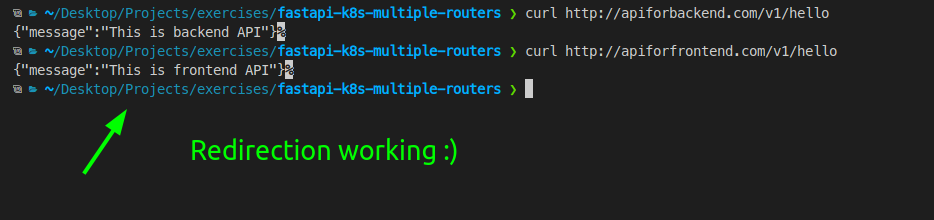
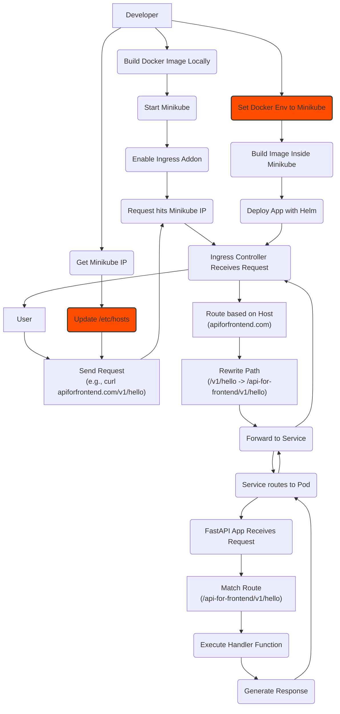
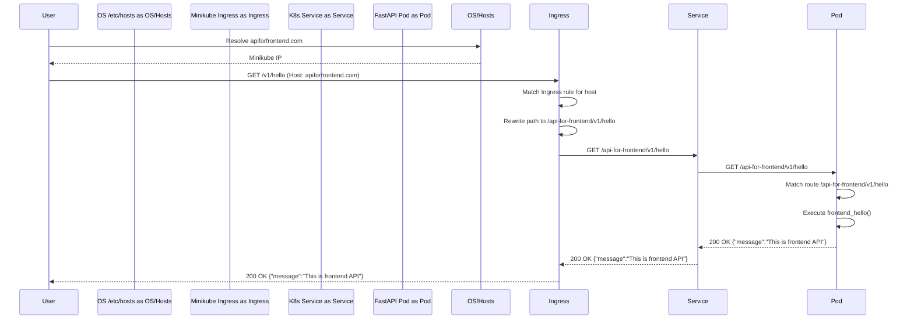
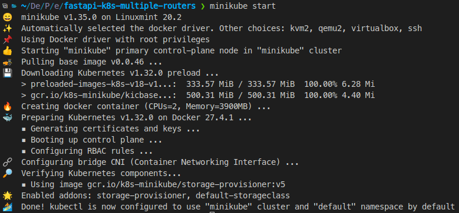
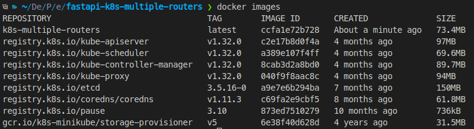
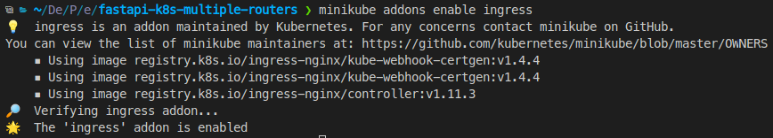

## Project Summary

This project demonstrates how to deploy a single FastAPI application to Kubernetes (Minikube) and use Nginx Ingress to expose different API endpoints based on the requested hostname. It shows how to configure Ingress rules to rewrite URL paths, allowing `apiforfrontend.com/*` to route to the `/api-for-frontend/*` prefix and `apiforbackend.com/*` to route to the `/api-for-backend/*` prefix within the same application instance.


### Result



### Project setup and Request flowchart


# Request sequence diagram



### Run it locally

Build the image
```shell
docker build -t k8s-multiple-routers .
```

Install minikube (if you don't have it) and start it
```shell
sudo apt install minikube # Debian/Ubuntu
minikube start
```


get the minikube ip in your local network
```shell
minikube ip
```

Add this two lines to your `/etc/hosts` (Replace minikube's ip)
```shell
minikube-ip-here apiforfrontend.com
minikube-ip-here apiforbackend.com
```

To build images inside minikube. It tells your local docker CLI  to talk to Minikube's Docker, so an image build, builds it inside Minikube and kubectl deployment can find it
```shell
eval $(minikube docker-env)
```

The previous command does some changes to some environment variables in your machine, so if you want to reset back to normal, run:
```shell
eval $(minikube docker-env -u)
```

If you do `docker images` after running each one of the previous two commands you should see two different list of images, here you can see how it looks inside minikube


Install Helm
```shell
curl -fsSL -o get_helm.sh https://raw.githubusercontent.com/helm/helm/main/scripts/get-helm-3
chmod 700 get_helm.sh
./get_helm.sh
rm get_helm.sh # if you want remove helm's installation script
```

Enable the Nginx Ingress Controller addon. This installs the controller needed to manage external access to services based on Ingress rules.
```shell
minikube addons enable ingress
```


Deploy the application using Helm
```shell
helm install k8s-multiple-routers ./charts/k8s-mutiple-routers
```

Then you can acces to your two separated domains
```shell
curl http://apiforbackend.com/v1/hello
{"message":"This is backend API"}

curl http://apiforfrontend.com/v1/hello
{"message":"This is frontend API"}
```